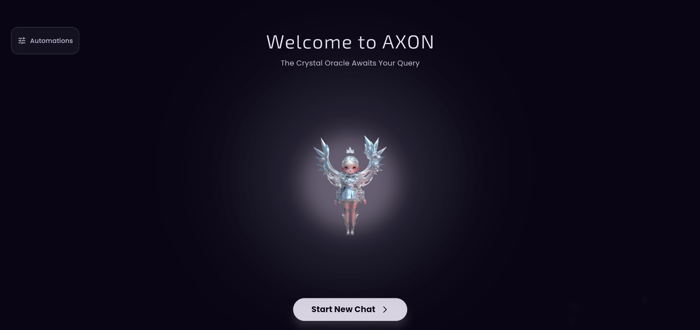

# AXON Mind: Futuristic Flutter AI Chatbot

AXON Mind is a cross-platform AI assistant built with Flutter, Dart, Riverpod, Material 3, and Cohere AI. It features a beautiful, animated UI, real-time spell checking, voice/image/text support, and seamless multi-platform deployment.

## Features
- **Three AI Personalities:** Instantly switch between Crystal Oracle, Witty AI, and Helpful Assistant for unique conversation styles.
- **Real-Time Spell Correction:** Smart suggestions and error-free messaging as you type.
- **Pre-Built Prompts:** Quick inspiration and user convenience with ready-to-use prompts.
- **Animated UI:** Moving logo PNG, glowing effects, and smooth transitions for a visually stunning experience.
- **Aesthetic Screens:** Beautiful splash, home, chat, and settings screens with modern design.
- **Responsive Design:** Optimized for mobile, tablet, desktop, and web.
- **Voice, Image, and Text Support:** Rich interactions with voice recording, image analysis, and text chat.
- **Modular Widgets & Clean Code:** Easy to maintain and extend.
- **Theme Toggle:** Switch between dark and light modes.
- **Advanced Customization:** Personalize your experience with settings and appearance options.
- **Error Handling & Loading States:** Robust and user-friendly.

## Screenshots
Add your screenshots below for:
- Splash Screen 
- Home Screen
- Menu
- Chat Screen
- Settings Screen

```
# Example:
# 
# !
# !
# !
# !](image-5.png)](image-4.png)
```

## Getting Started
1. Install Flutter: https://docs.flutter.dev/get-started/install
2. Clone this repo
3. Add your Cohere API key in `lib/services/cohere_service.dart`
4. Run `flutter pub get`
5. Run locally: `flutter run`
6. Build APK: `flutter build apk`
7. Build iOS: `flutter build ios`

## Deployment
- Ready for Android/iOS/Web/Desktop
- Firebase Hosting for assets (optional)

## Folder Structure
- `lib/` - Main app code
- `assets/` - Rive, Lottie, images

## Credits
- Designed and developed by MISHAL SALEEM

---
Replace placeholder assets and API keys with your own for production.
